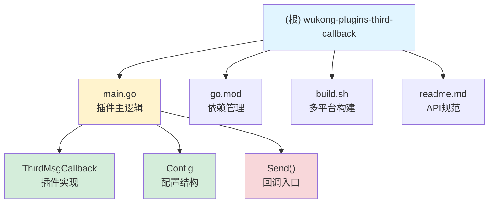

# 悟空IM第三方消息回调插件

> **最后更新**: 2025-11-18 14:52:07
> **项目类型**: 悟空IM Go 插件
> **语言**: Go 1.25
> **模块数量**: 1（单体项目）

---

## 变更记录 (Changelog)

| 日期 | 类型 | 说明 |
|------|------|------|
| 2025-11-18 14:52:07 | 初始化 | AI 上下文初始化，完成项目架构文档 |

---

## 项目愿景

为悟空IM提供第三方消息拦截与回调能力，允许在消息发送前将消息内容推送到外部系统进行审核、修改或拦截，支持灵活的安全签名和重试机制。

**核心价值**：
- 消息发送前的第三方审核能力
- 灵活的消息内容修改机制
- 企业级安全签名验证
- 可靠的重试与超时控制

---

## 架构总览

### 技术栈

- **语言**: Go 1.25
- **插件框架**: WuKongIM/go-pdk v1.0.3
- **日志**: WuKongIM/wklog + zap
- **协议**: WuKongIM/WuKongIMGoProto v1.0.21

### 插件信息

- **插件编号**: `wk.plugin.third.msg.callback`
- **版本**: `0.0.1`
- **优先级**: `1`
- **Hook点**: 消息发送前 (`Send`)

### 架构设计

```
┌─────────────┐         ┌──────────────────┐         ┌─────────────────┐
│  悟空IM服务  │ ──────> │  本插件(拦截器)   │ ──────> │  第三方回调URL   │
│             │  消息    │                  │  HTTP   │                 │
│             │ <────── │ - 签名生成        │ <────── │ - 审核/修改      │
└─────────────┘  结果    │ - 重试控制        │  响应   │ - 返回决策      │
                        │ - 超时处理        │         │                 │
                        └──────────────────┘         └─────────────────┘
```

### 数据流

1. **消息到达** → 悟空IM触发 `Send` 回调
2. **请求构造** → 提取消息元数据，计算签名（SHA1 + MD5）
3. **HTTP调用** → 发送到配置的第三方URL
4. **重试机制** → 失败时按配置重试N次
5. **结果处理**:
   - 允许发送 → `ReasonSuccess`
   - 拒绝发送 → `ReasonNotAllowSend`
   - 修改消息 → 更新 `Payload`
6. **超时处理** → 根据 `TimeoutSend` 配置决定是否放行

---

## 模块结构



---

## 模块索引

| 模块路径 | 职责 | 语言 | 入口文件 | 状态 |
|---------|------|------|---------|------|
| `.` (根) | 第三方消息回调插件 | Go 1.25 | `main.go` | ⚠️ 部分实现 |

**说明**:
- ⚠️ 表示 `Send()` 函数核心逻辑（签名生成、HTTP调用、重试）尚未实现
- 配置结构和插件框架已就绪

---

## 运行与开发

### 环境要求

- Go 1.25+
- 悟空IM服务（用于加载插件）

### 配置项

| 配置项 | 类型 | 说明 | 默认值 |
|-------|------|------|--------|
| `CallbackUrl` | string | 第三方接口URL | `http://localhost:6379` |
| `AppSecret` | string | 签名密钥 | `1234` |
| `Timeout` | int | 请求超时时间（秒） | `5` |
| `TimeoutSend` | bool | 超时后是否允许发送 | `false` |
| `Retries` | int | 重试次数 | `3` |

### 构建命令

```bash
# 本地构建（当前平台）
go build -o plugin.wkp main.go

# 多平台构建（通过脚本）
bash build.sh
```

**输出平台**:
- linux/arm64
- linux/amd64
- darwin/amd64（Intel Mac）
- darwin/arm64（Apple Silicon）

**输出目录**: `build/wk.plugin.third.msg.callback-{GOOS}-{GOARCH}.wkp`

### 插件安装

1. 将编译好的 `.wkp` 文件上传到悟空IM后台
2. 在后台配置界面填写上述配置项
3. 启用插件后，所有消息发送前将触发回调

---

## 对外接口

### HTTP 回调请求

**请求方法**: `POST`
**目标URL**: 由 `CallbackUrl` 配置

#### 请求头

| 参数名 | 类型 | 说明 |
|-------|------|------|
| `AppKey` | String | 应用的 App Key（来自配置） |
| `CurTime` | Long | 当前 UTC 时间戳（毫秒） |
| `MD5` | String | 请求体的 MD5 值 |
| `CheckSum` | String | 校验值 `SHA1(AppSecret + MD5 + CurTime)` |
| `Content-Type` | String | `application/json` |

#### 请求体

```json
{
  "msgBody": "string",       // 消息体
  "fromUid": "string",       // 发送者ID
  "channelId": "string",     // 频道ID
  "channelType": 1,          // 频道类型 (uint32) 1=单聊, 2=群聊
  "deviceId": "string",      // 设备ID
  "deviceFlag": 0,           // 设备类型: APP=0, WEB=1, PC=2, SYSTEM=99
  "deviceLevel": 0           // 设备级别: 0=从设备, 1=主设备
}
```

#### 响应体

```json
{
  "allow": true,             // 是否允许发送
  "msgBody": "string"        // （可选）修改后的消息体（base64格式）
}
```

### 插件钩子

| 钩子方法 | 触发时机 | 参数 | 返回值 |
|---------|---------|------|--------|
| `Send(c *pdk.Context)` | 消息发送前 | PDK上下文 | 通过 `c.SendPacket.Reason` 控制 |

**Reason枚举**:
- `wkproto.ReasonSuccess` (0) → 允许发送
- `wkproto.ReasonNotAllowSend` (1) → 拒绝发送

---

## 关键依赖

### 核心依赖

```
github.com/WuKongIM/go-pdk v1.0.3          // 插件开发框架
github.com/WuKongIM/wklog v0.0.0-20250123  // 日志库
go.uber.org/zap v1.27.0                    // 结构化日志
```

### 间接依赖

- `WuKongIMGoProto` v1.0.21 → 协议定义
- `wkrpc` → RPC通信
- `gnet` v2.7.1 → 网络库
- `lumberjack` v2.2.1 → 日志轮转

---

## 数据模型

### 内部结构

#### Config 配置

```go
type Config struct {
    CallbackUrl string  // 第三方URL
    AppSecret   string  // 签名密钥
    Timeout     int     // 超时秒数
    TimeoutSend bool    // 超时是否发送
    Retries     int     // 重试次数
}
```

#### 回调请求

```go
type ThirdMsgCallbackReq struct {
    MsgBody     string             // 消息体
    FromUid     string             // 发送者ID
    ChannelId   string             // 频道ID
    ChannelType uint32             // 频道类型
    DeviceId    string             // 设备ID
    DeviceFlag  wkproto.DeviceFlag // APP=0, WEB=1, PC=2, SYSTEM=99
    DeviceLevel uint8              // 0=从设备, 1=主设备
}
```

#### 回调响应

```go
type ThirdMsgCallbackResp struct {
    Allow   bool     // 是否允许发送（对应JSON中的allow字段）
    MsgBody *string  // （可选）修改后的消息体（base64格式，对应JSON中的msgBody字段）
}
```

---

## 测试策略

### 当前状态

⚠️ **缺失**: 项目尚无测试文件

### 推荐测试层级

1. **单元测试** (`*_test.go`)
   - 签名生成逻辑测试
   - 配置解析测试
   - 超时与重试策略测试

2. **集成测试**
   - Mock HTTP Server 模拟第三方接口
   - 测试各种响应场景（成功/失败/超时/非法签名）
   - 测试消息修改功能

3. **E2E测试**
   - 在真实悟空IM环境中加载插件
   - 发送测试消息验证回调流程

### 测试覆盖重点

- ✅ 签名算法正确性（SHA1 + MD5）
- ✅ 重试机制（指数退避或固定间隔）
- ✅ 超时控制（`context.WithTimeout`）
- ✅ 消息修改后的正确传递
- ✅ 错误日志完整性

---

## 编码规范

### Go 风格

- 遵循 Go 官方 [Effective Go](https://go.dev/doc/effective_go)
- 使用 `gofmt` 格式化代码
- 错误处理优先使用 `if err != nil` 模式
- 结构体字段使用 JSON tag 标注（用于悟空IM后台配置）

### 日志规范

- 使用 `zap` 结构化日志
- 错误级别：`Error`、`Warn`、`Info`、`Debug`
- 关键操作必须记录：
  - 第三方调用成功/失败
  - 重试次数与结果
  - 签名验证失败

### 错误处理

```go
// 推荐模式
if err != nil {
    r.Error("Failed to call third-party API",
        zap.String("url", r.Config.CallbackUrl),
        zap.Error(err))
    // 根据配置决定是否允许发送
    if r.Config.TimeoutSend {
        c.SendPacket.Reason = uint32(wkproto.ReasonSuccess)
    } else {
        c.SendPacket.Reason = uint32(wkproto.ReasonNotAllowSend)
    }
    return
}
```

---

## AI 使用指引

### 适合 AI 协助的任务

#### 1. 核心逻辑实现 ⭐⭐⭐

**任务**: 完成 `Send()` 函数的核心逻辑
**提示词**:
```
请在 main.go 中实现 ThirdMsgCallback.Send() 方法，要求：
1. 构造 ThirdMsgCallbackReq 结构体（从 c.SendPacket 提取）
2. 生成签名（SHA1 + MD5，参考 readme.md 规范）
3. 发起 HTTP POST 请求到 r.Config.CallbackUrl
4. 实现重试机制（最多 r.Config.Retries 次）
5. 解析响应（ThirdMsgCallbackResp），根据 allow 字段设置 c.SendPacket.Reason
6. 如果响应包含修改后的消息（msgBody非空），更新 c.SendPacket.Payload
7. 超时控制使用 context.WithTimeout
8. 添加详细的日志记录
```

#### 2. 测试编写 ⭐⭐⭐

**任务**: 创建 `main_test.go`
**提示词**:
```
为 wukong-plugins-third-callback 项目创建单元测试，包括：
1. 测试签名生成函数（SHA1 + MD5）
2. 测试重试逻辑（使用 httptest.Server）
3. 测试超时场景（TimeoutSend=true/false）
4. 测试消息修改功能
5. Mock PDK Context 进行端到端测试
```

#### 3. 错误处理增强 ⭐⭐

**提示词**:
```
增强 Send() 方法的错误处理：
1. 区分网络错误、超时错误、业务错误
2. 为每种错误类型添加特定的日志字段
3. 实现指数退避重试策略
4. 添加熔断机制（连续N次失败后暂停）
```

#### 4. 性能优化 ⭐

**提示词**:
```
优化插件性能：
1. 使用 HTTP 连接池（http.Client 复用）
2. 异步日志（buffered logger）
3. 减少内存分配（sync.Pool 复用结构体）
4. 添加性能指标（请求耗时、成功率）
```

### 不适合 AI 的任务

- ❌ 悟空IM插件框架的核心修改（需深入理解PDK机制）
- ❌ 生产环境配置决策（AppSecret、Timeout 等业务相关）
- ❌ 安全审计（需人工评估签名强度、重放攻击风险）

### 上下文提示

**当前代码状态**:
- ✅ 配置结构已定义
- ✅ 插件框架已集成
- ⚠️ `Send()` 方法仅有注释，无实现
- ❌ 缺少测试

**关键文件优先级**:
1. `main.go` → 核心实现
2. `readme.md` → API规范（签名算法依据）
3. `go.mod` → 依赖版本锁定

---

## 常见问题 (FAQ)

### Q1: 如何调试插件？

**A**: 悟空IM插件以 Go Plugin 形式加载，本地调试推荐：
1. 在 `Send()` 方法中添加详细日志
2. 使用 `go build -gcflags="all=-N -l"` 编译调试版本
3. 在悟空IM配置中启用 DEBUG 日志级别
4. 通过 `tail -f wukongim.log` 查看实时日志

### Q2: 签名验证失败如何排查？

**A**: 检查以下步骤：
1. `MD5` = MD5(请求体JSON字符串)
2. `CurTime` = 当前UTC时间戳（毫秒）
3. `CheckSum` = SHA1(AppSecret + MD5 + CurTime) 的小写十六进制
4. 确保第三方使用相同的 `AppSecret`

### Q3: 超时后消息会丢失吗？

**A**: 取决于 `TimeoutSend` 配置：
- `true` → 超时后**允许发送**，消息正常投递
- `false` → 超时后**拒绝发送**，消息被拦截

### Q4: 可以修改消息的哪些内容？

**A**: 根据 `ThirdMsgCallbackResp` 结构：
- ✅ 可修改：`msgBody`（消息体，base64格式）
- ❌ 不可修改：发送者ID、接收者、频道ID等元数据

### Q5: 重试策略是什么？

**A**: 当前设计为固定重试次数（`Retries`），建议实现时：
- 使用指数退避（1s, 2s, 4s...）
- 记录每次重试的详细日志
- 达到最大次数后根据 `TimeoutSend` 决定

---

## 文件清单

### 根目录文件

| 文件 | 类型 | 行数 | 说明 |
|------|------|------|------|
| `main.go` | Go | 82 | 插件主逻辑（⚠️ 部分实现） |
| `go.mod` | 依赖 | 27 | Go 模块定义 |
| `go.sum` | 依赖锁 | - | 依赖哈希校验 |
| `build.sh` | Shell | 36 | 多平台编译脚本 |
| `readme.md` | 文档 | 61 | API 规范与功能说明 |
| `CLAUDE.md` | 文档 | - | 本文档 |

### 构建产物（build/）

```
build/
├── wk.plugin.third.msg.callback-linux-arm64.wkp
├── wk.plugin.third.msg.callback-linux-amd64.wkp
├── wk.plugin.third.msg.callback-darwin-amd64.wkp
└── wk.plugin.third.msg.callback-darwin-arm64.wkp
```

---

## 下一步建议

### 高优先级 ⭐⭐⭐

1. **实现核心逻辑**
   - 完成 `Send()` 方法
   - 实现签名生成函数
   - 实现 HTTP 调用与重试

2. **添加单元测试**
   - 创建 `main_test.go`
   - 覆盖签名、重试、超时等核心场景

3. **错误处理完善**
   - 区分错误类型
   - 添加详细日志
   - 实现熔断机制

### 中优先级 ⭐⭐

4. **性能优化**
   - HTTP 连接池
   - 减少内存分配
   - 添加性能指标

5. **集成测试**
   - 搭建 Mock HTTP Server
   - 测试真实悟空IM环境

### 低优先级 ⭐

6. **文档完善**
   - 添加使用示例
   - 绘制序列图
   - 编写故障排查手册

7. **CI/CD**
   - 添加 GitHub Actions
   - 自动化测试与构建
   - 版本发布流程

---

## 联系与反馈

**项目维护**: 左良
**插件作者**: 左良
**问题反馈**: https://github.com/zuoliang0/wukong-plugins-third-callback

---

**文档生成工具**: Claude AI 架构师
**生成时间**: 2025-11-18 14:52:07
